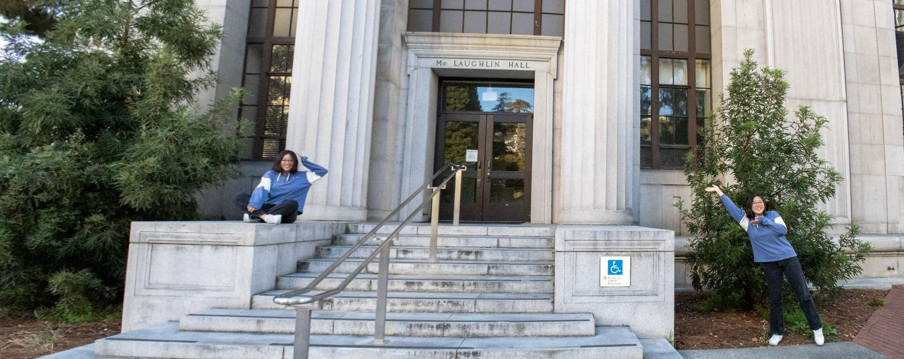

Here are some projects that I've completed. Some of them are class projects. 
## [CS 194-26 Project 4: [Auto]Stitching Photo Mosaics](projects/194-26_project_4B/index.html)
How do I create a panorama from seperate pictures? Look here!

## [AmphibiaWeb: In memory of David Wake](https://museum-of-vertebrate-zoology.github.io/biogeolab/wake_map/index.html)
This map contains the range of all the species that Professor David Wake had described in his papers. We collected all the range maps of the species, and visualized them in one map. Click on the range to view the species! We created this interactive map with Leaflet and QGIS. Extra styling was done with CSS and HTML. Currently I'm working on using JavaScript to make the interactions more user-friendly. 
<iframe src="https://museum-of-vertebrate-zoology.github.io/biogeolab/wake_map/index.html#4/8.97/-99.10" height="500px" width = "700px"></iframe>

## [CS 194-26 Project 3: Face Morphing](projects/194-26_project_3/index.html)
We've all seen cool face morphing GIF on the Internet. But how?
<a href = "https://yuerout.github.io/projects/194-26_project_3/index.html"></img></a> 
 Yeah that's my face morphed into George Clooney's face!
