# CS 194-26 Project 3: Face Morphing
## Part 1. Defining Correspondences
For this part, I manually defined 45 points and added four edge points based on the shape of the image. One of the things I noticed for selecting keypoints is that since my lip's shape differs from George's a lot, I had to select more points for the lip to decrease the ghosting effect. 

Picture of me:
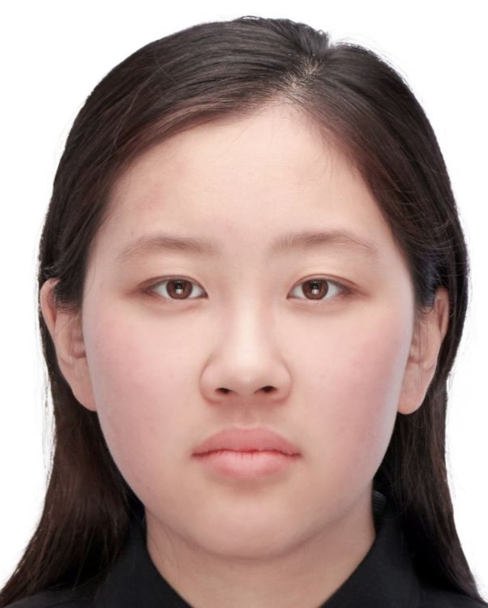
Keypoints on my face defined by hand:
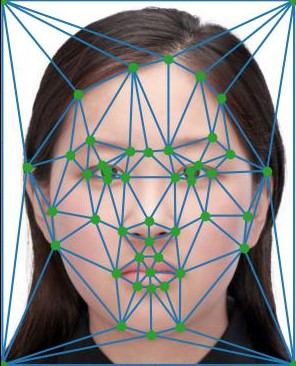
Picture of George:
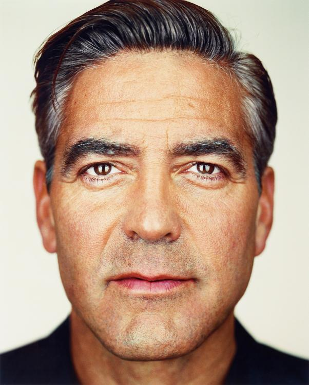
Keypoints on George's face defined by hand:
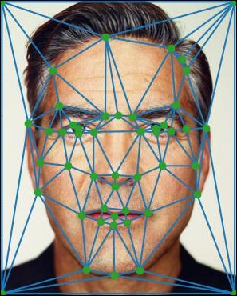

(Triangulation here is just for demo purpose -- I did not use triangulation on original faces)

## Part 2. Computing the "Mid-way Face"
Next I computed the midway points between my face and Georges, and computed a trigulation with Delaunay triangles:
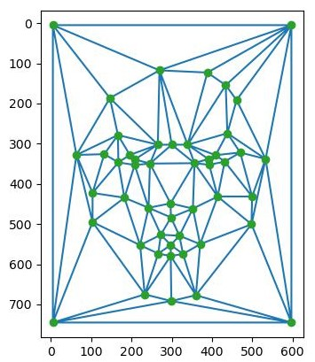

Next, I tried to compute the affine matrix `A` for each triangle from the original images (me/George) to the midway face triangle. Then I took the inverse of `A` and got the inverse transformation from the midway face triangle to the original face triangle. This inverse matrix will tell us where each pixel in the midway face comes from, so that we can obtain the color information of this pixel from its origin in the original images. Ideally, it's a bijection, but usually the result of inverse transformation is in decimal, which means that the origin of the midway triangle pixel is in between two pixels in the original images. To get the exact value of the midway pixel, I interpolate the nearby pixels in the original image to get a value for the color of the midway pixel. 
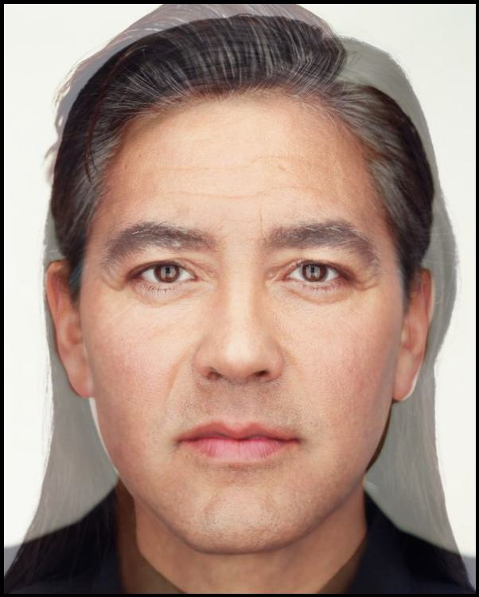

## Part 3. The Morph Sequence
In this part, I produced a sequence of images with different `warp_frac` and `dissolve_frac`, which controls the amount of warping and dissolving for each originla picture (In the midway face, I set both to 0.5). The complete sequence is here:

## Part 4. The "Mean face" of a population
In this part, I used the Danes dataset of faces with neutral expressions. The resulting average face shape looks like this:
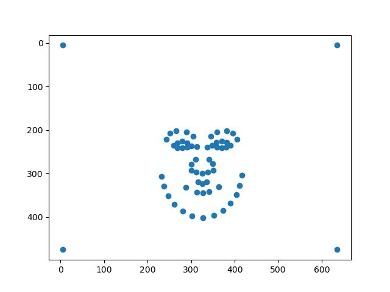
Some faces morphed into the average shape:
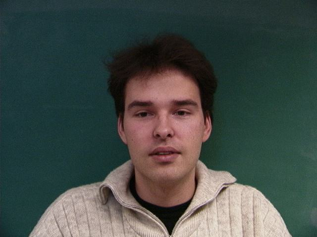
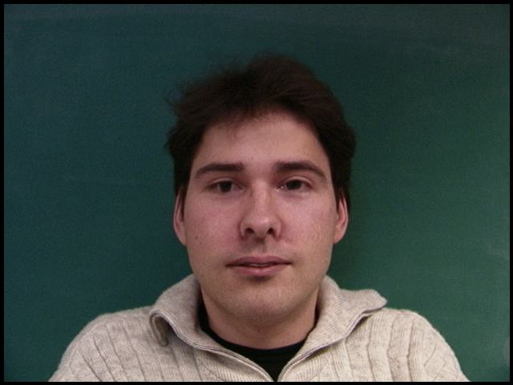

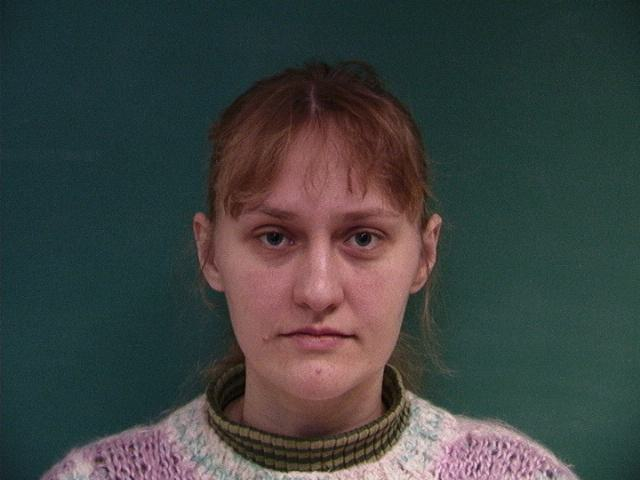
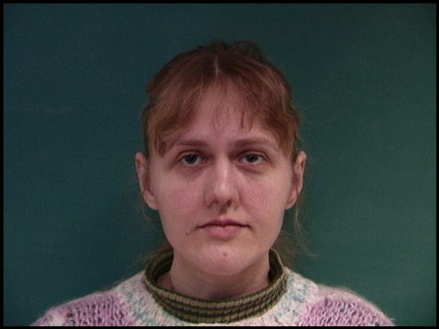

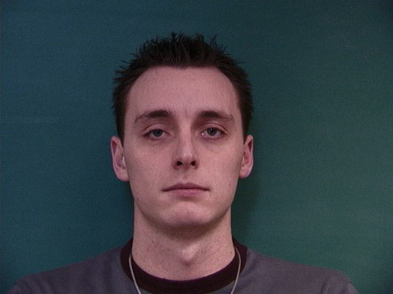
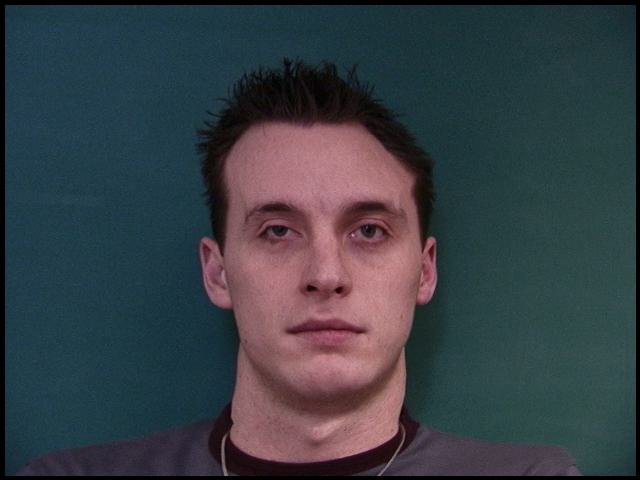
The final resulting average face:
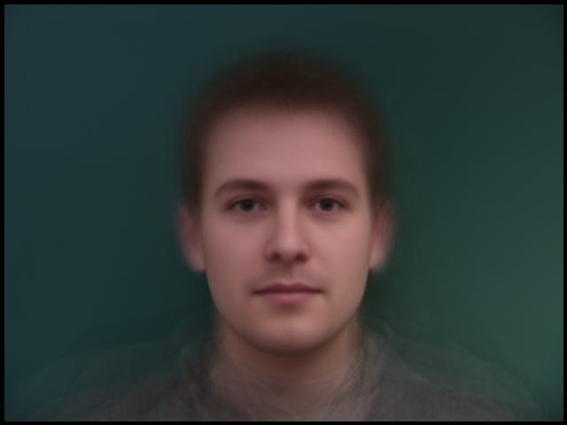

To my face warped into the average face's geometry, I cropped and resize the average face and my face to be of the same dimension:

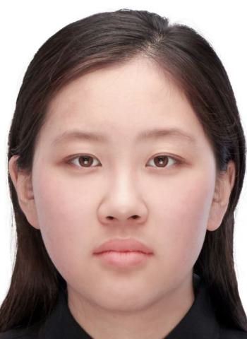
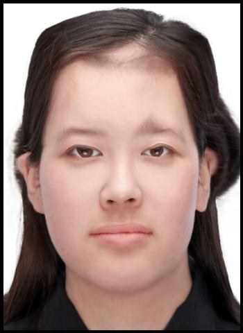
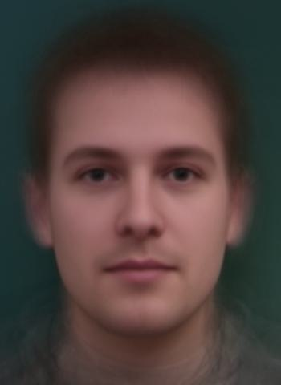
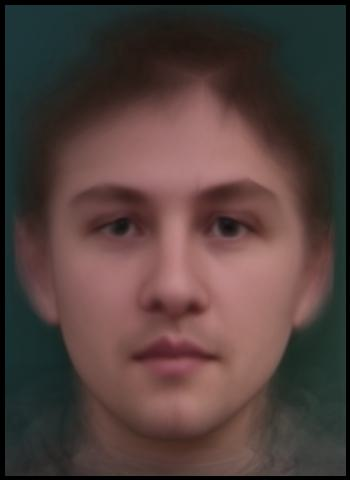

## Part 5. Caricatures: Extrapolating from the mean
I subtract the mean face points from my face's points to get the delta, and then multiplied delta by different coefficients to obtain caricatures of me on different levels. 
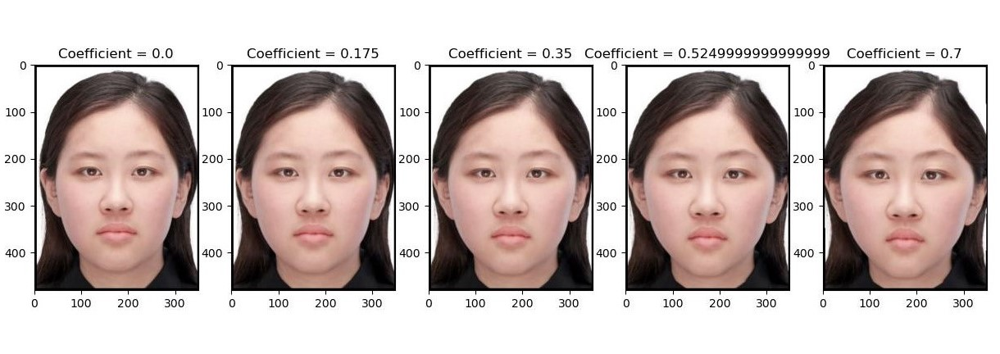

## Bells and Whistles: Make me smile!
I look very unhappy on this pictures, so I tried to make myself smile. Therefore, I first computed the mean face of all the smiling faces:
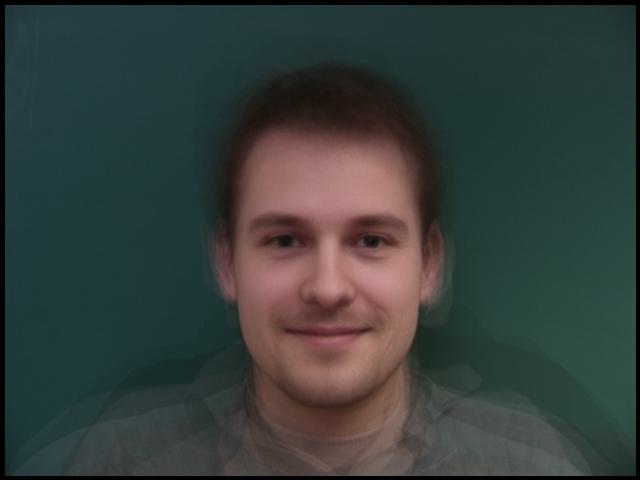
To make my smile more natural, I also defined a new set of keypoints with more keypoints on lips. 
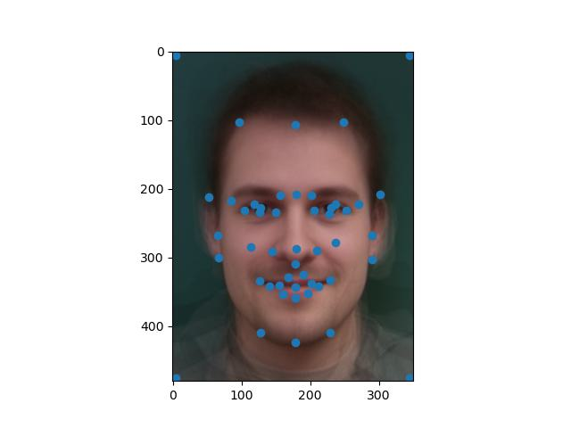
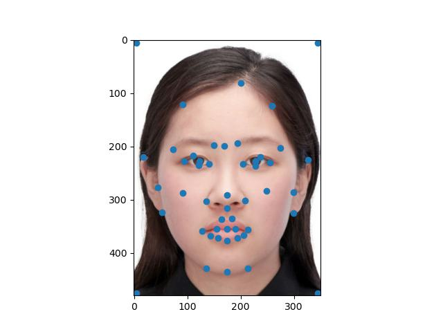
To get the "smiling vector", I subtract my face from the smiling average and added the smiling vector to my face. 
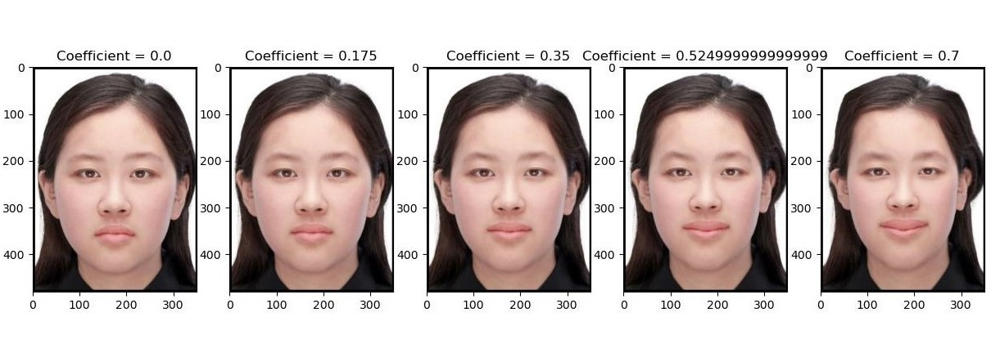
I'm smiling happily, in case you can't tell :-)