# CS 193-24 Project 4A: IMAGE WARPING and MOSAICING
### Yuerou Tang
All images are shot on Nikon D7500 with AF-P NIKKOR 18-55mm DX VR lens. 

## Part 1: Recovering Homography
I first shot the images on Shattuck Ave. 
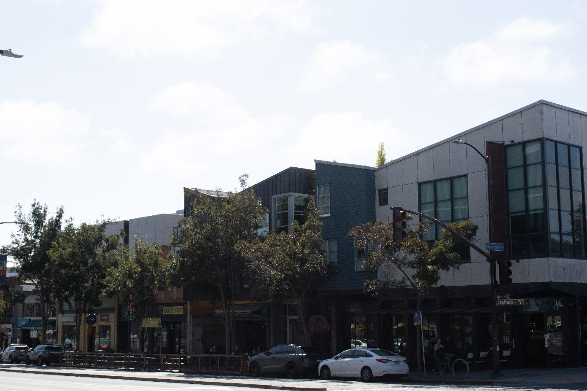
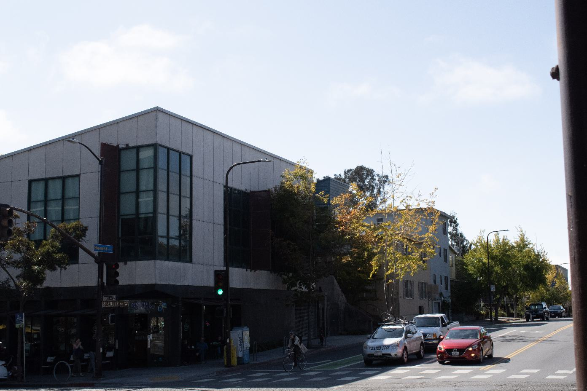

I choose to project the left image of Shattuck Ave to the right image. First I calculated the projective transformation matrix from left to right with 9 common points I selected from the two images. 
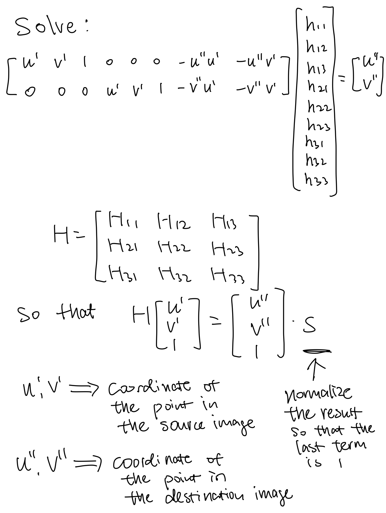

## Part 2: Warping Images
I used inverse warping to get the warped images. First I calculated the corresponding points in the original image of the warped image with H_inverse. Then I used interpolation to find the value of the warped image pixel. To make sure the full image is warped, I calculated the corresponding points in the warped image of the four corners in the original image, then made a canvas based on coordinates of the four corners in the transformed image. 

Image of the left side of Shattuck Ave. warped:
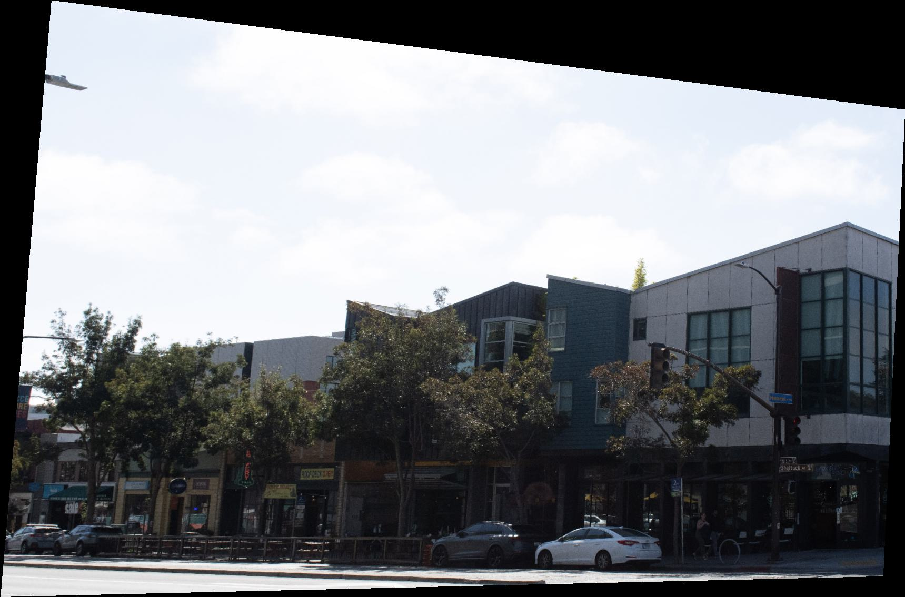

## Part 3: Image Rectification
To test that my warping function works properly, I tested the function on this image of a sticker:
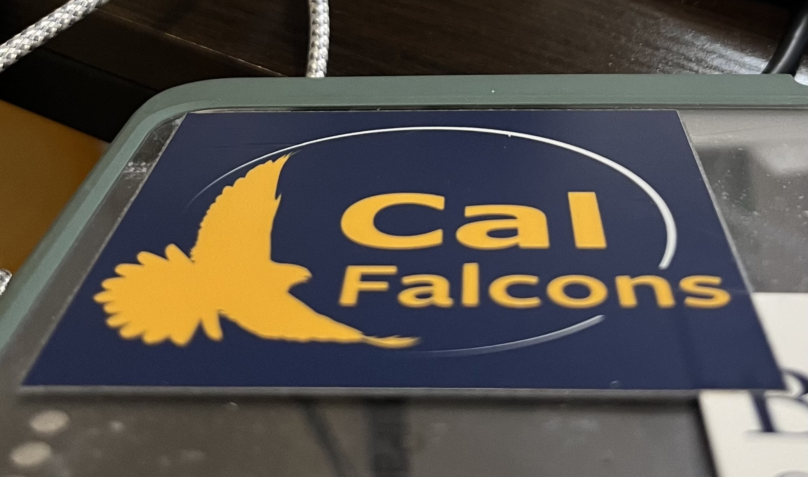
After rectification:
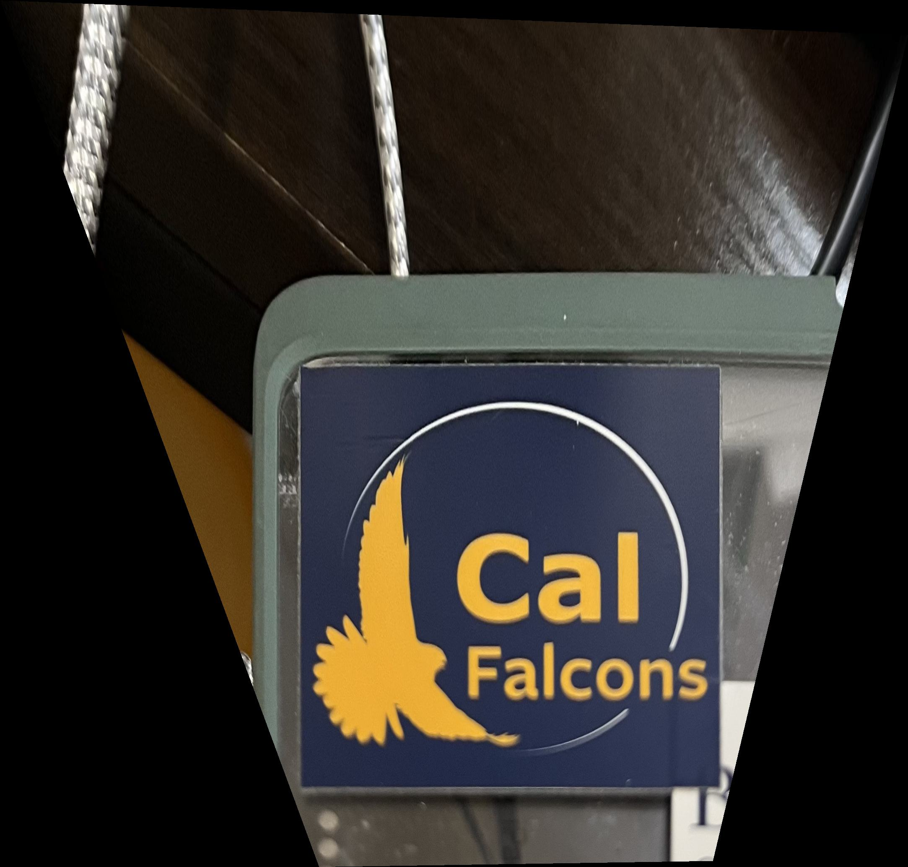

## Part 4: Blending
To blend my images, I picked the seam to be in the overlap region of the two images, and use pyramid blending with a mask. Everything left of the seam on the mask is 1 and right of the seam is 0. 
Mask:

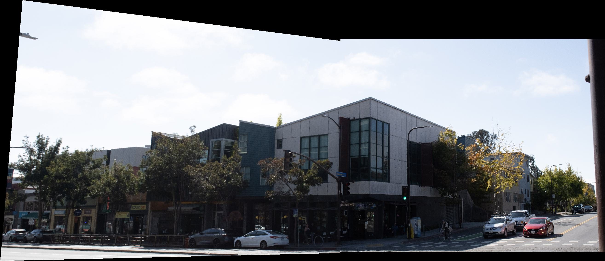

## Some other results:
VLSB:
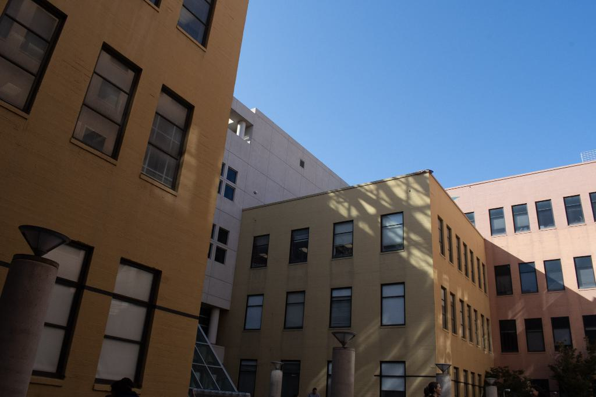
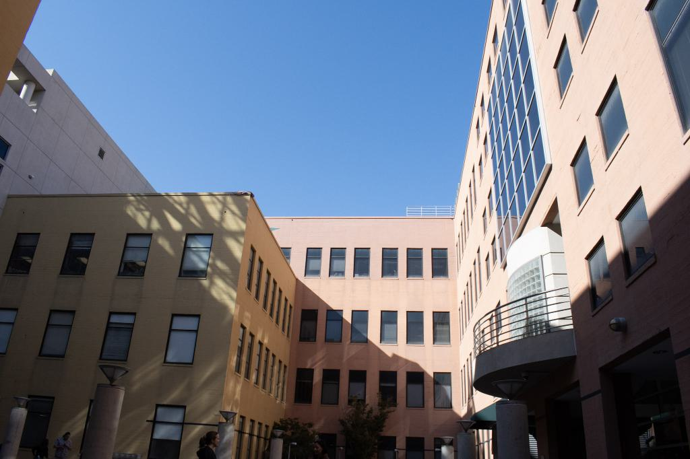
Stitched:
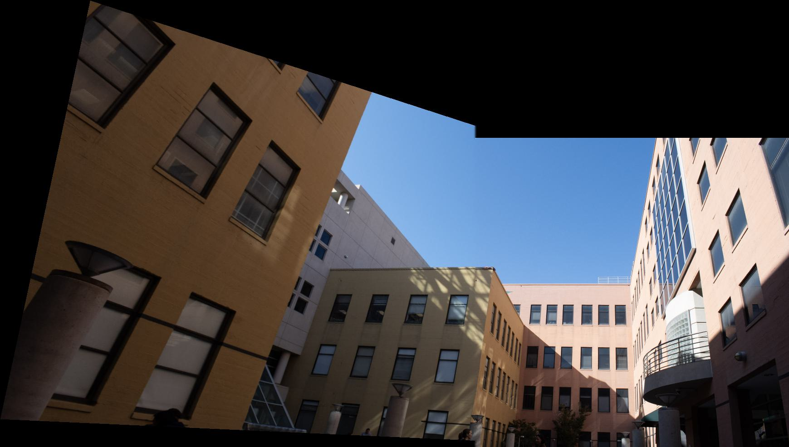

Me in front of Engineering Building:
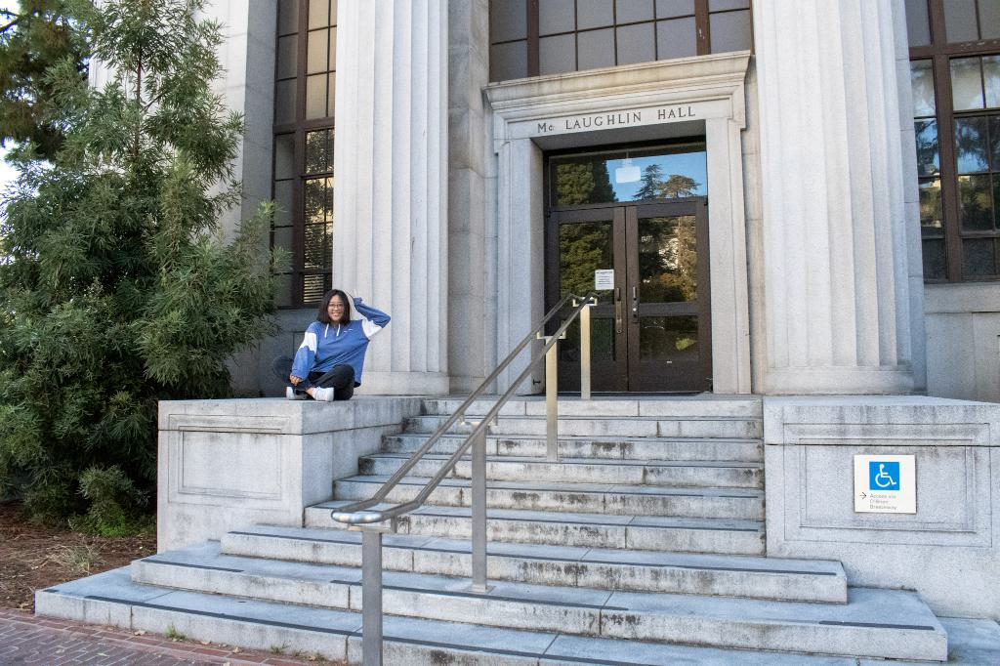
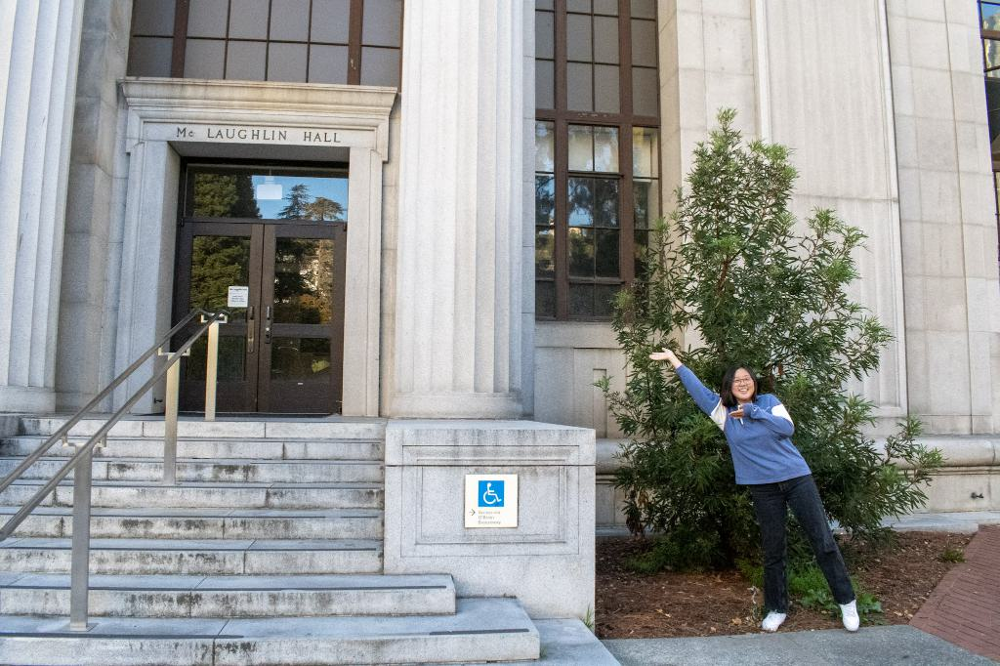
Stitched:
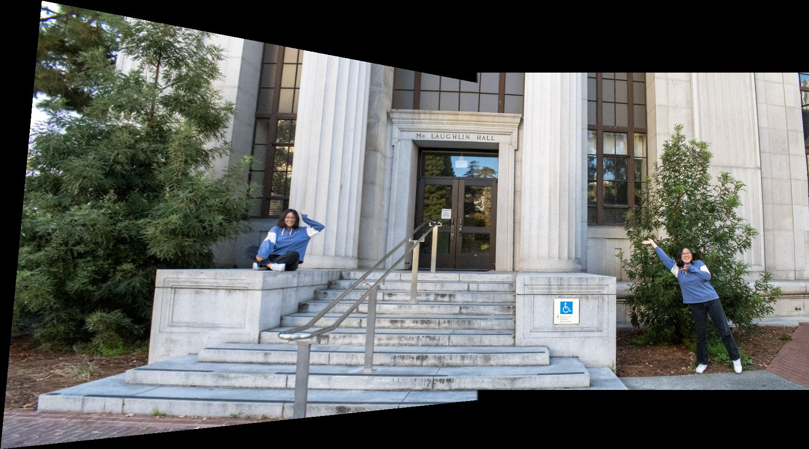
After some cropping:
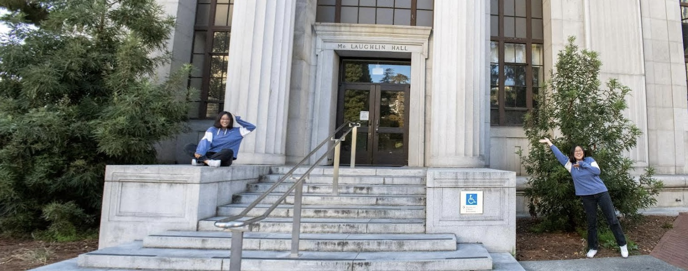
