# Part 2 FEATURE MATCHING for AUTOSTITCHING
In the previous part, the transformation was computed from the points that I manually selected. In this part, I implemented automatic keypoint detection.
## Step 0: Harris Corner Detector
I first applied the Harris Coner Detector to the image. I changed the `min_distance` parameter in `peak_local_max` to 5 to reduce the number of corners. 
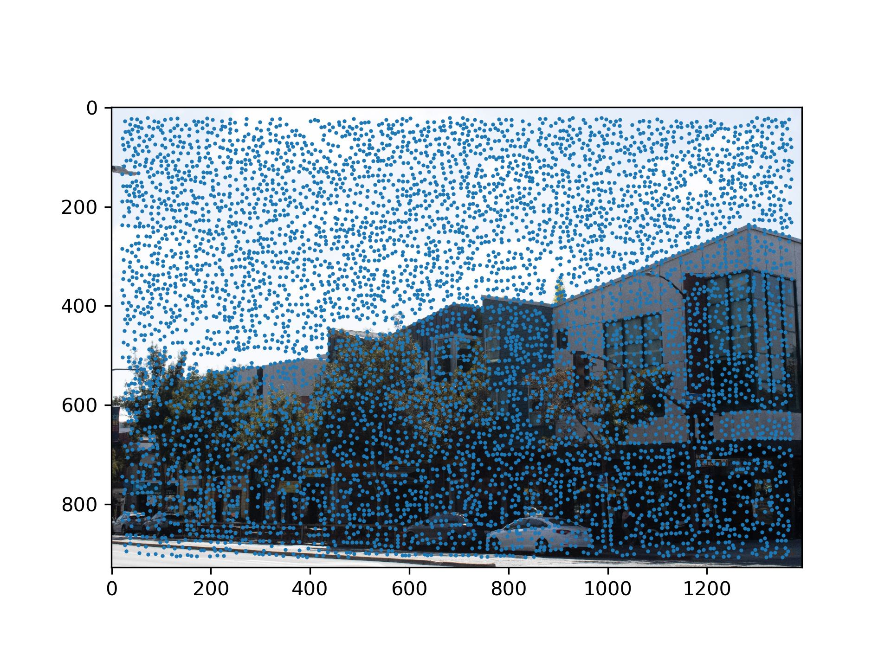
## Step 1: Adaptive Non-Maximal Suppression
We obtained a lot of interest points from the previous step. However, some points are trivial and have very low strength. To suppress this points, I calculated the minimum suppression radius for all the interest points in the image. 
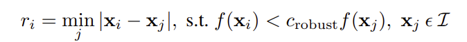
Intuitively, this formula makes sense, because if a interest point is not trivial, then in the neighborhood it resides in, it should be the most significant point in the neighborhood. If this neighborhood is very large, then this point should be very significant. Therefore we rank the minimum suppression radius of all the interest points, and take the top 500 points to be our result for this step. 
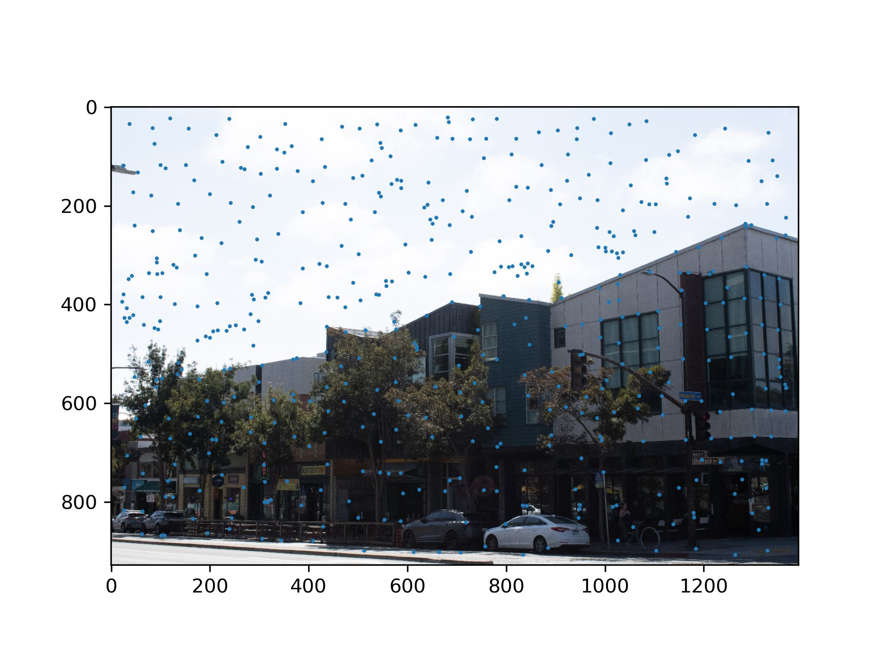
## Step 2: Feature Descriptor extraction
I downscaled the image by 0.2 (40x40 --> 8x8) and took 8x8 patches from the image according to the coordinates of the interest points. Then I normalized the features descriptors. 
One example feature:
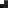
Where the feature is on the image:
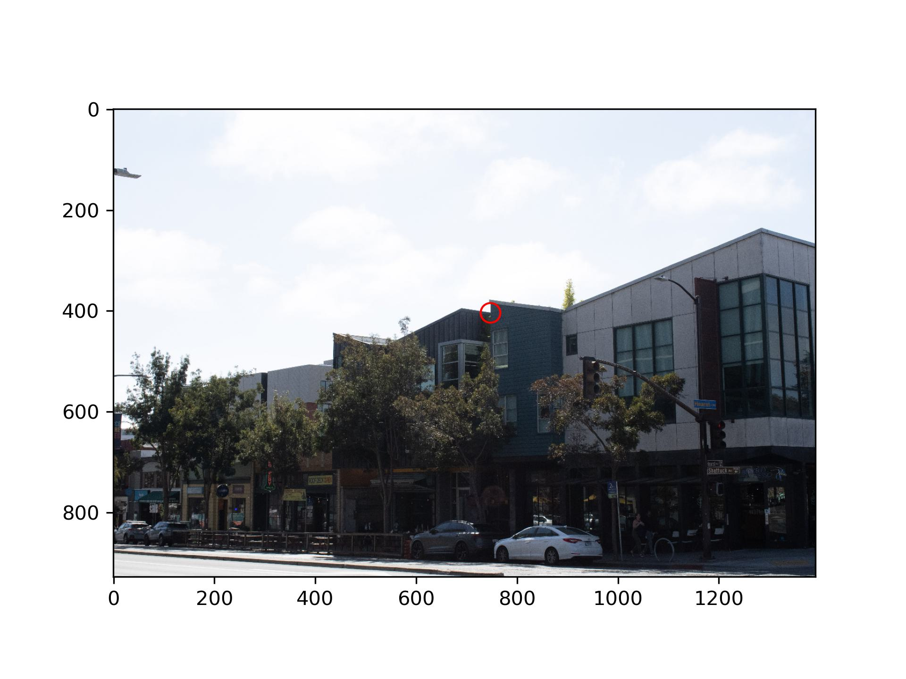
## Step 3: Feature Matching
With the features, it possible to filter out some interest points that don't look the same. By using Lowe's trick, which says if the best match doesn't beat the second best match by too much, then both of them are not the correct match, we can further reduce the number of interest points. 
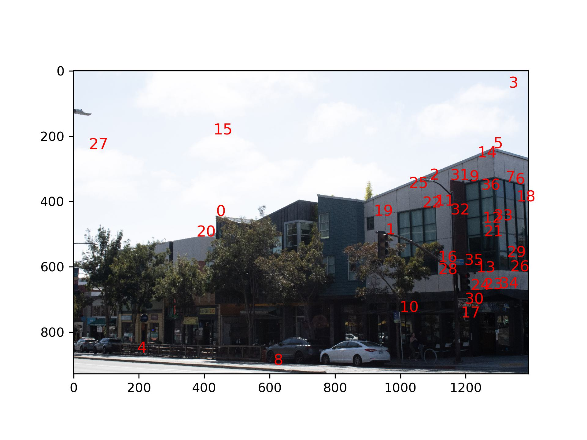
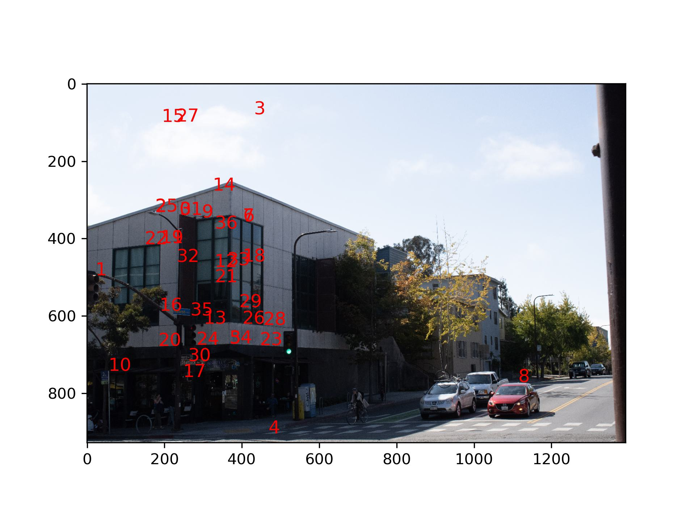
## Step 4: RANSAC
RANSAC filters out spatially inconsistent points. First, it randomly select a group of 4 points in the source image, then computes a homography based on these four points. Then it compute the transformation of all the source points based on the homography, and checked the deviation of calculated points location from the actual point location in the destination. Points with a smaller deviation are considered inliers. This process is then repeated many times, and the largest group of inliers is considered the final spatially consistent points. (RANSAC is very robust from my observation)
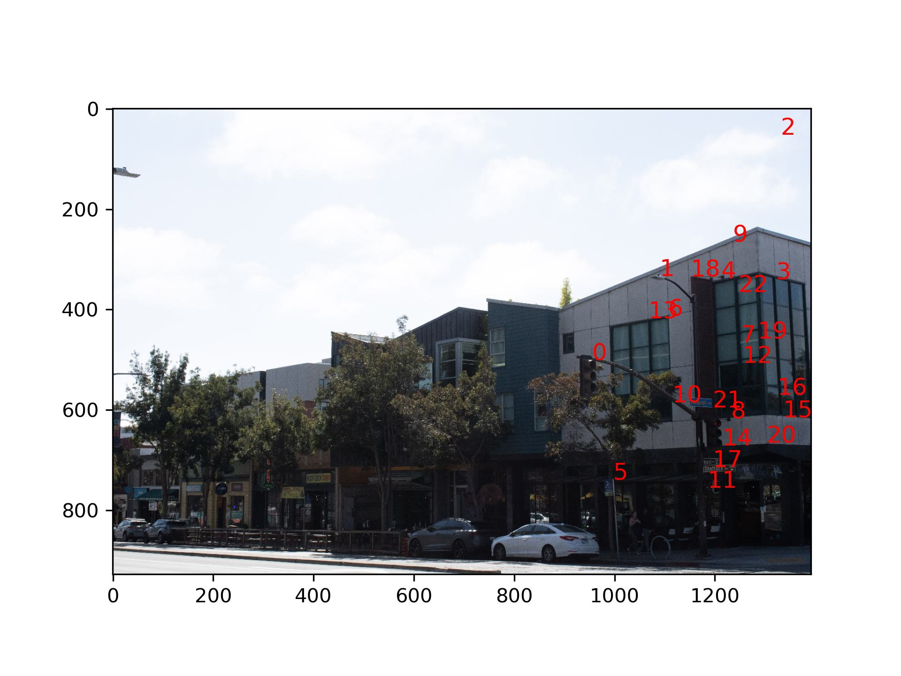
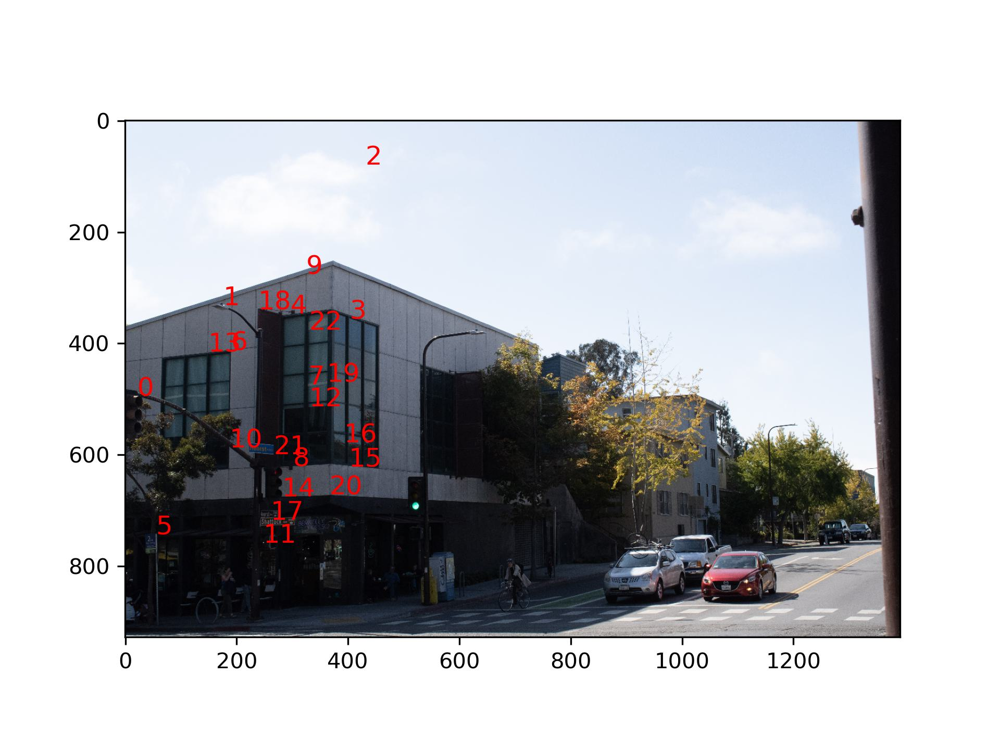

## Final Result
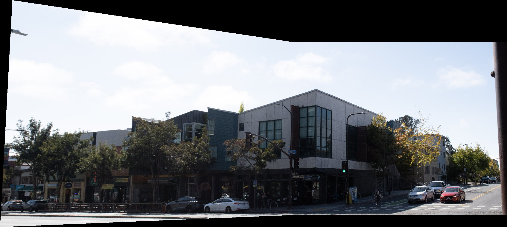
## Gallery
### Same pictures from part 1:
VLSB:
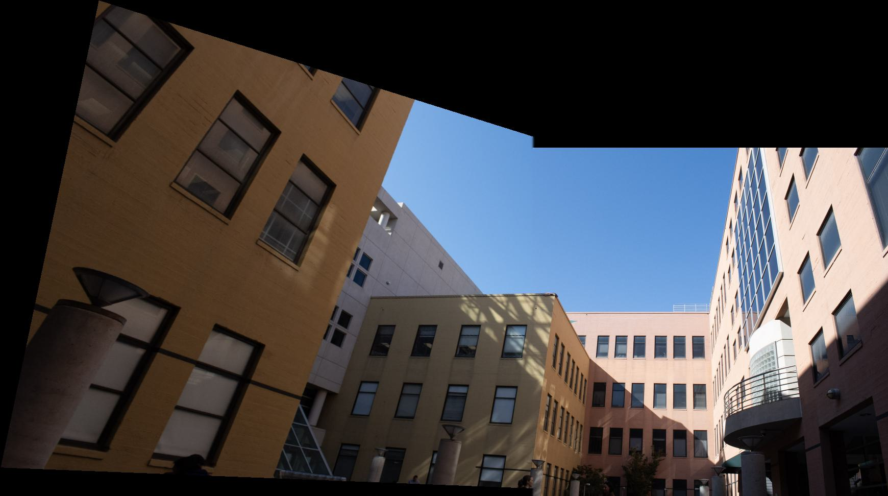

Me in front of Engineering Stitched:
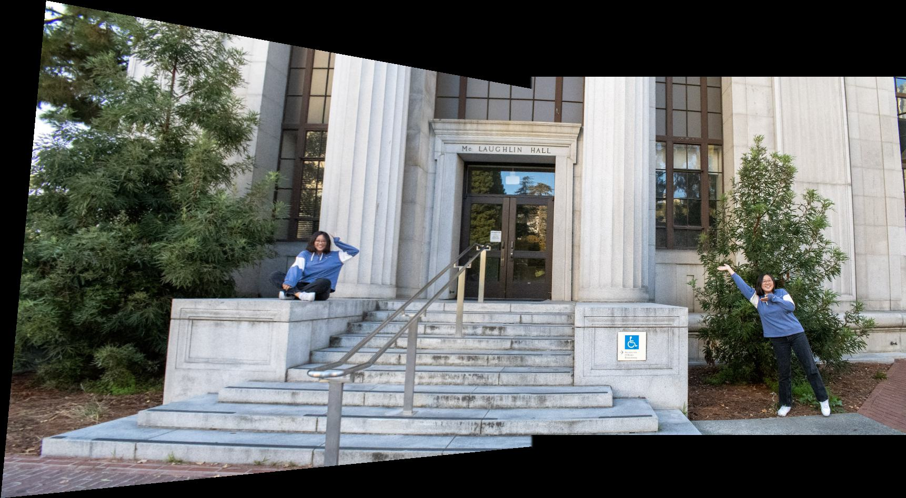
Cropped:

### Some new pictures:
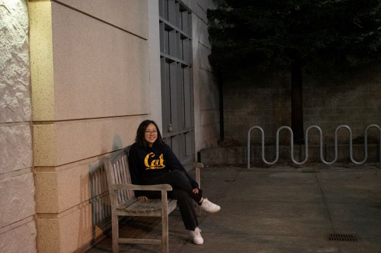
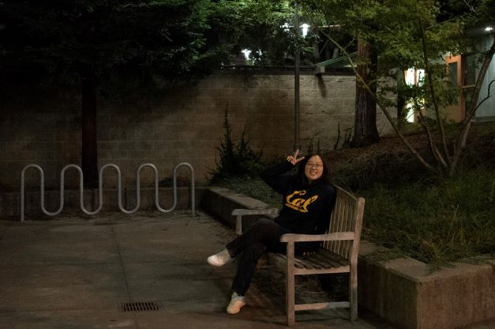
Stitched:
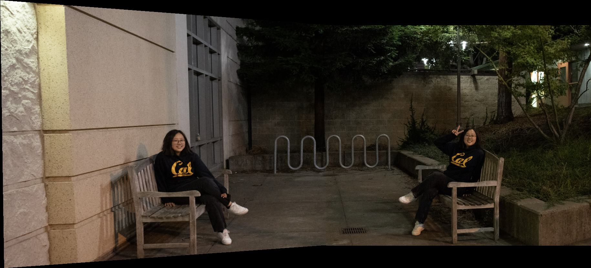
Cropped:
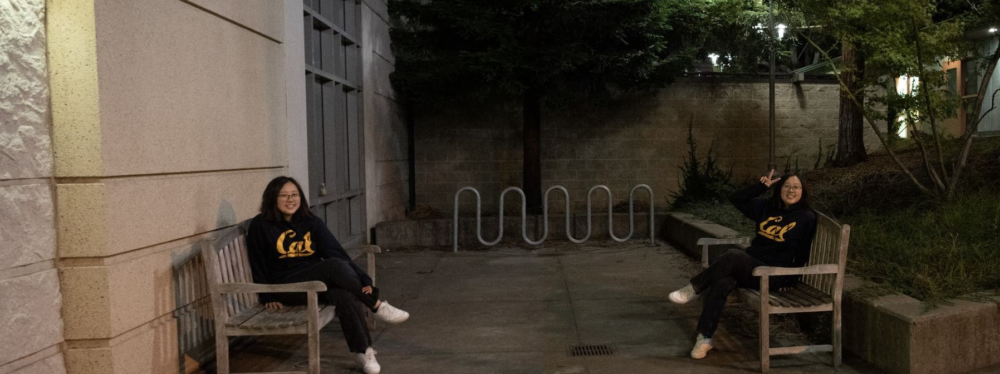

## What have I learned
This is so far my favorite project. In summer when I was working for an organization, they asked me to read a paper which used SIFT features for pairing images together. Understanding that paper was very hard for me -- it took me a week to understand what was going on with Lowe's ratio test in the paper. I also skipped the RANSAC section completely because I could not understand it. 194-26 explained those to me very clearly, and I feel so proud of myself for implementing it in this project :-D
